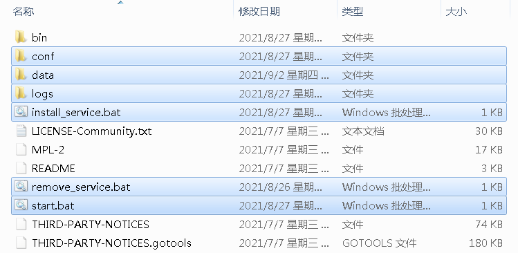
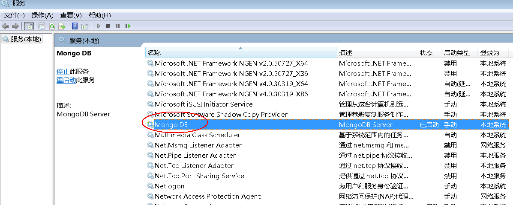

# 广告管理系统部署文档

# 安装MongoDB数据库

## 下载安装

- 下载地址`https://fastdl.mongodb.org/win32/mongodb-win32-x86_64-2012plus-4.2.15.zip`
- 下载完后解压到**D盘**
- 进入mongodb目录并新建三个文件夹:**conf**、**data**、**logs**
- 进入**conf**目录，新建一个文件并命名**mongod.cfg**，**mongod.cfg**文件内容如下，需要修改**logpath**为刚才新建的**logs**完整路径

```
#指定日志文件，该文件将保存所有的日志记录、诊断信息。除非另有指定，mongod将所有的日志信息输出到标准输出。如果没有指定logappend，重启则日志会进行覆盖操作。
logpath=D:\ProgramFiles\MongoDB\Server\4.2.15\logs\mongodb.log

#写日志的模式：设置为true为追加。默认是覆盖。如果未指定此设置，启动时MongoDB的将覆盖现有的日志文件。
logappend=true

#数据存放目录。默认：/data/db/
dbpath=D:\ProgramFiles\MongoDB\Server\4.2.15\data

storageEngine=wiredTiger

#端口。默认27017，MongoDB的默认服务TCP端口，监听客户端连接。要是端口设置小于1024，比如1021，则需要root权限启动，不能用mongodb帐号启动，（普通帐号即使是27017也起不来）否则报错：[mongo --port=1021 连接]ERROR: listen(): bind() failed errno:13 Permission denied for socket: 127.0.0.1:1021
port=27017

#是否后台运行，设置为true 启动 进程在后台运行的守护进程模式。默认false。
#windows没有这个参数
#fork=true

#数据库分析等级设置。记录一些操作性能到标准输出或则指定的logpath的日志文件中，默认0:关闭。
#0 关。无分析。
#1 开。仅包括慢操作。
#2 开。包括所有操作。
profile=1

#记录profile分析的慢查询的时间，默认是100毫秒。具体同上。
slowms=1000

#副本集名称
replSet=rs0
```
- 新建**install_service.bat**，内容如下，需要修改**mongod.cfg**路径为刚才新建的完整路径

```
bin\mongod --install --serviceName MongoDB --serviceDisplayName "Mongo DB" --config D:\ProgramFiles\MongoDB\Server\4.2.15\conf\mongod.cfg
pause
```

- 新建**remove_service.bat**，内容如下

```
bin\mongod --remove --serviceName MongoDB
pause
```

- 新建**start.bat**，内容如下，需要修改**mongod.cfg**路径为刚才新建的完整路径

```
bin\mongod --config D:\ProgramFiles\MongoDB\Server\4.2.15\conf\mongod.cfg
pause
```

- 完成以上操作后的目录效果如下



- 双击运行**install_service.bat**，把**mongodb**安装到**windows服务**。运行命令`services.msc`可以看到**MongoDB**服务，只要这个服务设置为**自动**，并且是启动状态即可。



- 其它文件说明
  - `remove_service.bat`。把**MongoDB**从**windows服务**列表移除
  - `start.bat`。如果**windows服务**没有启动，也可以通过双击运行这个文件启动**MongoDB**
  - `data`。数据库数据存储的地方，非常重要。
  - `logs`。数据库运行输出的日志，可以用来分析软件运行情况以及帮助排查问题。
  - `conf`。数据库运行的配置信息。
  
# 安装运行ams软件

- 解压`ams.zip`
- 进入ams目录
- 运行`安装window服务.bat`，安装成功后**Windows服务**会多一个**广告管理系统**
- 运行`启动window服务.bat`

# 使用ams软件

- 打开浏览器输入网址`http://localhost:8080/ams`
- 管理员账号：`admin`，密码：`admin`